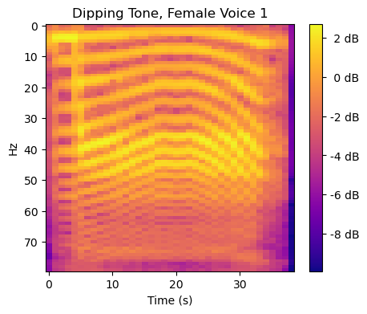
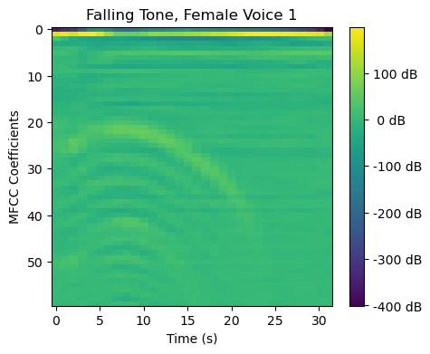

# **Learning Human-like Tonal Inflections for Humanoid Robotics**
### A simple CNN for classifying tones in audio signals recorded from a humanoid robot mouth.
---

>Model architecture adpated from [https://github.com/adhishthite/sound-mnist](https://github.com/adhishthite/sound-mnist)

>Mandarin Tone processing adapted from [https://github.com/alicex2020/Mandarin-Tone-Classification](https://github.com/alicex2020/Mandarin-Tone-Classification)

>Human audio files sourced from Tone Perfect: [https://tone.lib.msu.edu/](https://tone.lib.msu.edu/)
---
## **1 Data Augmentation**  
The iteration time for updating the robot hardware to test different configurations in the hopes of obtaining a more human-like sound would be long. Therefore, we chose to augment data from the robot in different ways to speed up iteration cycles.

1. The data augmentation process included first compressing the audio signal from three seconds to one second. 

2. Due to a shortened wavelength when compressing the audio signal, this resulted in an increased pitch. Each audio signal was then pitched down by 1.5 octaves to return to its original pitch. This was based on human perception of the original pitch and was not quantitatively computed.

3. The pitch shifting operation caused the decibel level of each signal to be reduced significantly so each signal was increased by 15 decibels. 

4. A mic pop at the beginning of each audio signal was removed. 

5. A 0.25 second fade in/fade out effect was added to each audio signal to mimic the change in volume that may occur when a human opens and closes their mouth.

---
## **2 Data Pre-Processing**
The way in which data is processed before inputting it into any kind of machine learning or deep learning model is fundamental. In the domain of audio, there are several concepts that aid in data pre-processing.

## Spectrograms

Digital representations of audio signals most often begin as the relationship of amplitude and time. To represent these signals in the frequency domain, a Fast Fourier Transform (FFT) is performed over several windowed segments of the signal. What results is called a spectrogram. Spectrograms are visualizations or figures of audio that represent the spectrum of frequencies over time for an audio recording.

If frequency is converted from Hertz to the Mel Scale, a representation of frequency that mimics the perception of sound by humans and hence why it’s used often in machine learning, the spectrogram is called a Mel Spectrogram. 

## Mel Frequency Cepstral Coefficients (MFCC)
The Mel Frequency Cepstrum (MFC) is a discrete cosine transformation (DCT) on the log of the magnitude of the Fourier spectrum which is obtained by applying a Fourier transform on the time signal. MFCC’s are coefficients that collectively make up an MFC. MFCC's visually represent features of the audio remarkably well and therefore can be passed into a convolutional neural networks for classification.

---
## **2 Model Architecture** 
* 3 convolution layers  
* 1 max pooling layer
* 3 fully connected layers 
* ReLU activation for every convolutional layer
* Batch normalization for every convolutional and fully-connected layer
* Dropout for every fully-connected layer
* Softmax activation for last layer in MLP

---
## **3 Training and Testing on Robot Audio Signals**
The goal for this part was to ensure the model architecture and hyperparameters could effectively classify robot audio signlas. 1,120 robot audio signals were split 80/20 into training and validation datasets. 

---
## **4 Training on Human Audio Signals and Testing on Robot Audio Signals**
The goal here was to learn the model on audio signals produced by humans, specifically 4,500 signals from the Tone Perfect Multimodal Database, and be tested on 1,120 audio signals produced by the robot to determine if the robot sounds were human-like.

We wanted the model to generalize enough such that it could maintain high accuracy given a validation set of MFCCs that may look very different from what it was trained on, but still reflect the human-likeness of the validation set through its softmax output predictions: high value predictions for human-like sounds and low value predictions for non-human-like sounds. 